# OpenAgentCLI

A coding agent with MCP server and native tool calling.

## High-Level Architecture

```mermaid
flowchart TB

%% ========================
%% LAYERS
%% ========================

subgraph PresentationLayer["Presentation Layer"]
    User(["🧑‍💻 User"])
    CLI["💬 CLI Interface"]
end

subgraph LLMLayer["LLM Layer"]
    ProtocolAdapter["🔌 Protocol Adapter"]
    BaseModel["🧠 BaseModel"]
    ModelCall["🌐 API / 🖥️ Local LLM Call"]
end

subgraph InfrastructureLayer["Infrastructure Layer"]
    Config["⚙️ Config Loader"]
    Storage[("🗄️ Message Store")]
end

subgraph ToolLayer["Tool Layer"]
    ToolExec["🛠️ Tool Executor"]
    MCP["🔗 MCP Server"]
end

%% ========================
%% FLOWS
%% ========================

User -- input --> CLI
CLI -- user msg --> ProtocolAdapter
ProtocolAdapter -- send to model --> BaseModel
BaseModel -- response: msg or toolcall --> ProtocolAdapter
ProtocolAdapter -- msg/toolcall result --> CLI

CLI -- save/load chat history <--> Storage
CLI -- load settings --> Config

ProtocolAdapter <-- tool call --> ToolExec
ToolExec -- call --> MCP
MCP -- result --> ToolExec

%% BaseModel call
BaseModel -- call --> ModelCall

%% ========================
%% STYLING
%% ========================

User:::presentation
CLI:::presentation
ProtocolAdapter:::llm
BaseModel:::llm
ModelCall:::llm
Config:::infra
Storage:::infra
ToolExec:::tools
MCP:::tools

classDef presentation fill:#E3F2FD,stroke:#1565C0,stroke-width:1.5px,color:#0D47A1
classDef llm fill:#E8F5E9,stroke:#2E7D32,stroke-width:1.5px,color:#1B5E20
classDef tools fill:#FFF3E0,stroke:#EF6C00,stroke-width:1.5px,color:#E65100
classDef infra fill:#F3E5F5,stroke:#8E24AA,stroke-width:1.5px,color:#4A148C

%% ========================
%% LINKS
%% ========================

click CLI "https://github.com/SuperMK15/OpenAgentCLI/tree/main/openagentcli/main.py"
click ProtocolAdapter "https://github.com/SuperMK15/OpenAgentCLI/tree/main/openagentcli/protocol/adapter.py"
click BaseModel "https://github.com/SuperMK15/OpenAgentCLI/tree/main/openagentcli/models/base.py"
click Config "https://github.com/SuperMK15/OpenAgentCLI/tree/main/openagentcli/config.py"
click Storage "https://github.com/SuperMK15/OpenAgentCLI/tree/main/openagentcli/chat_storage.py"
click ToolExec "https://github.com/SuperMK15/OpenAgentCLI/tree/main/openagentcli/tool_executor.py"
click MCP "https://github.com/SuperMK15/OpenAgentCLI/tree/main/openagentcli/server/mcp_server.py"
```


## Installation

```bash
pip install -e .
```

## Usage

Set your API key via environment variable:
```bash
export COHERE_API_KEY="your-api-key"
```

Or create a `.env` file at the project root:
```
COHERE_API_KEY=your-api-key
```

Run the CLI:
```bash
openagentcli
```

## Configuration

Modify the `config.yaml` file at the project root to customize behavior:

```yaml
# Model configuration
model_config:
  file_name: cohere_model
  class_name: CohereModel

# Custom instructions to inject into the system prompt
custom_instructions: |
  You are a helpful coding assistant.
```

The `custom_instructions` field allows you to add custom behavior or constraints to the assistant.

## Commands

- `/help` - Show available commands
- `/tools` - List all available tools
- `/tools <name>` - Show detailed information for a specific tool
- `/clear` - Clear chat context
- `/quit` - Exit the CLI
- `!<command>` - Execute bash commands directly

## Structure

- `openagentcli/models/` - AI model interfaces (BaseModel, CohereModel)
- `openagentcli/server/` - FastMCP server with coding tools
- `openagentcli/main.py` - Main entry point with native tool calling

## Available Tools

- `read_file(path)` - Read file contents
- `write_file(path, content, command)` - Write to file (create/str_replace/insert/append)
- `list_directory(path, depth)` - List directory contents (depth=0 for current only, depth>0 for recursive)
- `search_files_by_name(pattern, path)` - Search for files by name using regex pattern
- `search_files_by_content(pattern, path)` - Search for files by content using regex pattern
- `shell(command)` - Execute bash commands

## Features

- Native Cohere tool calling (command-a-03-2025)
- Multi-step tool use with automatic reasoning
- Fine-grained citations
- Y/N/T confirmation for mutating operations

## Adding New Models

1. Create a new adapter in `openagentcli/protocol/`:
```python
from openagentcli.protocol import ProtocolAdapter, Message, ToolDefinition

class MyProviderAdapter(ProtocolAdapter):
    # Override role strings if provider uses different names
    ROLE_USER = "user"  # default
    ROLE_ASSISTANT = "assistant"  # default
    ROLE_TOOL = "tool"  # default
    ROLE_SYSTEM = "system"  # default
    
    def to_provider_messages(self, messages: list[Message]) -> Any:
        # Convert internal Message format to provider's format
        pass
    
    def from_provider_response(self, response: Any) -> Message:
        # Convert provider's response to internal Message format
        pass
    
    def to_provider_tools(self, tools: list[ToolDefinition]) -> Any:
        # Convert internal ToolDefinition to provider's format
        pass
    
    def to_tool_result(self, tool_call_id: str, result: dict) -> Message:
        # Convert tool result to internal Message format
        pass
```

2. Create model class extending `BaseModel`:
```python
from openagentcli.models.base import BaseModel
from openagentcli.protocol import Message, ToolDefinition

class MyProviderModel(BaseModel):
    def __init__(self, custom_instructions: str = None):
        super().__init__(MyProviderAdapter(), custom_instructions)
        # Initialize your provider's client
        # Build system prompt and append self.custom_instructions if provided
    
    def chat(self, messages: list[Message], tools: list[ToolDefinition]) -> Message:
        provider_messages = self.adapter.to_provider_messages(messages)
        provider_tools = self.adapter.to_provider_tools(tools)
        response = self.client.chat(...)  # Call provider API
        return self.adapter.from_provider_response(response)
    
    def chat_stream(self, messages: list[Message], tools: list[ToolDefinition]) -> Message:
        # Implement streaming if supported
        pass
```

3. Update `config.yaml` to use your model:
```yaml
model_config:
  file_name: my_provider_model
  class_name: MyProviderModel
```
